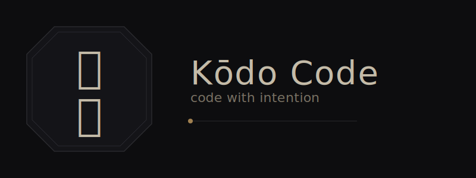
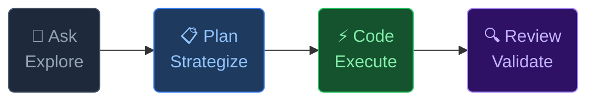
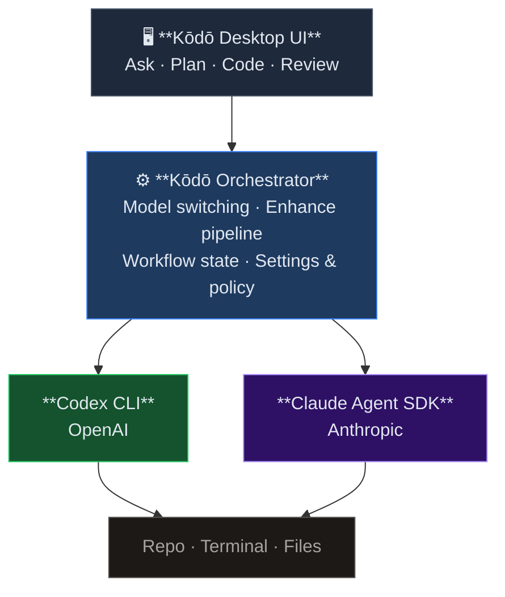
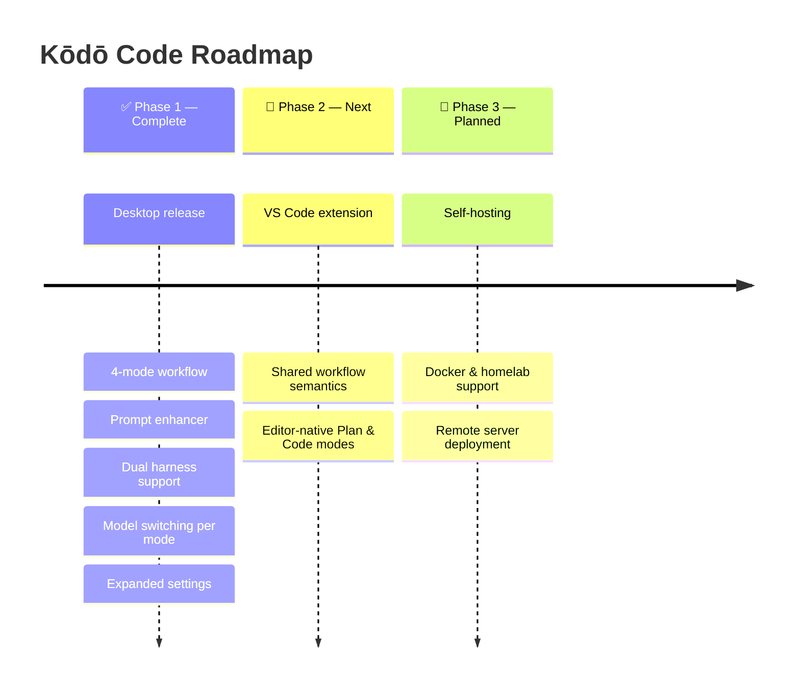

<div align="center">

<br>


**The orchestration layer between you and your AI harnesses —**
**so Codex CLI and Claude Agent SDK work the way you think, not the other way around.**

<br>

[]()
[](LICENSE)
[]()
[]()
[]()

<br>

</div>

---

<br>

## The Problem

> Most tools force a choice: **good harness** _or_ **good workflow.**

You end up either wiring raw CLI tools into your own scripts, or accepting opinionated wrappers that bury settings, collapse planning into execution, and lock you to one provider.

|     | What you have today               | What you actually need                  |
| :-: | :-------------------------------- | :-------------------------------------- |
| 🧠  | One mode for everything           | Distinct modes for distinct intents     |
| 🔧  | Settings buried in implementation | A first-class configuration surface     |
| 🔒  | Locked to one provider            | Harness choice per project, per session |
| ✍️  | Prompts as you typed them         | Prompts refined to your intent level    |

Kōdō Code reduces cognitive overhead by separating exploration, planning, execution, and validation into distinct modes.

**Kōdō Code gives you both.** Codex and Claude execute. Kōdō orchestrates.

<br>

---

<br>

## What is Kōdō?

**Kōdō (香道)** — the Japanese Way of Incense — centers on ritual, attention, and deliberate choice.

**Kōdō Code** applies that same idea to software development: a structured coding environment where thinking, planning, execution, and review stay separate and intentional.

It wraps **[Codex CLI](https://developers.openai.com/codex/cli/)** and **[Claude Agent SDK](https://docs.anthropic.com/en/docs/claude-code)** in a clearer workflow, without reinventing what those harnesses already do well.

<br>



<br>

---

<br>

## Four Modes. One Intention.

Kōdō Code is built around a simple rule: **you should not have to think, plan, execute, and validate in the same mental mode.**

<br>

<details open>
<summary><b>🤔 Ask Mode</b> &nbsp;—&nbsp; question without execution</summary>
<br>

Probe your codebase and your agents before committing to anything. Ask without triggering execution.

- _"Can we add this feature without breaking the mobile layout?"_
- _"How hard would it be to implement real-time sync?"_
- _"What changed in the last three PRs?"_

No side effects. No surprises. Just answers.

<br>
</details>

<details>
<summary><b>📋 Plan Mode</b> &nbsp;—&nbsp; strategize before you build</summary>
<br>

Designate a dedicated planning model — higher reasoning, slower deliberation — to map out your next move before a single file is touched.

- _"Design an approach to fix this long-standing bug."_
- _"Break down this feature into safe, reviewable increments."_

Plans are artifacts. They carry forward into execution.

<br>
</details>

<details>
<summary><b>⚡ Code Mode</b> &nbsp;—&nbsp; build with precision</summary>
<br>

Switch to your acting model — optimized for speed and accuracy — and execute with the full weight of your approved plan.

- Rich diffs, terminal output, and execution visibility
- Context carried forward from your plan
- Auto-switches to your designated acting model

<br>
</details>

<details>
<summary><b>🔍 Review Mode</b> &nbsp;—&nbsp; verify and validate</summary>
<br>

You built it. Now make sure it actually works — and that you didn't break anything you weren't looking at.

- _"Make sure the new backend handles edge cases."_
- _"Look for regressions for users coming from an older version."_
- _"Run the test suite and tell me what's left to fix."_

<br>
</details>

<details>
<summary><b>🔀 Dual Harness Support</b> &nbsp;—&nbsp; your choice of execution engine</summary>
<br>

The same workflow semantics, regardless of which harness runs underneath.

- **[Codex CLI](https://developers.openai.com/codex/cli/)** — OpenAI's native agent harness
- **[Claude Agent SDK](https://docs.anthropic.com/en/docs/claude-code)** — Anthropic's agent SDK

Switch per-project. Switch per-session. The orchestration layer doesn't care — it stays consistent either way.

<br>
</details>

<details>
<summary><b>📄 Plans as Artifacts</b> &nbsp;—&nbsp; plans that persist and carry forward</summary>
<br>

Plans aren't just conversation turns — they're stored artifacts with state. A plan created in Plan Mode persists, can be referenced later, and tracks whether it's been implemented. Code Mode carries the approved plan forward as structured context, not just chat history.

<br>
</details>

## Architecture



> **Rule:** _Harnesses execute. Kōdō orchestrates._

<br>

---

<br>

## Prompt Enhancement

Refine your request before you send it into Ask, Plan, Code, or Review.

Kōdō Code can sharpen your prompt at three levels of enhancement, but this is **not a mode itself**. It is a preparation layer for clearer intent before orchestration hands work to the harness.

| Level        | What it does                                                |
| :----------- | :---------------------------------------------------------- |
| **Minimal**  | Fixes grammar, typos, and clarity. Your words, cleaned up.  |
| **Balanced** | Expands your intent into a well-scoped, structured prompt.  |
| **Vibe**     | Full rewrite. Every ounce of the vibe, maximally expressed. |

The current default preset in settings is `balanced`.

<br>

---

<br>

## How It Compares

_Illustrative comparison as of April 15, 2026. This category changes quickly._

|                         |      **Kōdō Code**       |    Cline     |   Roo Code   |  Claude Code  |   Codex CLI   |
| :---------------------- | :----------------------: | :----------: | :----------: | :-----------: | :-----------: |
| **Harness**             | Codex + Claude Agent SDK |  API-based   |  API-based   | Native Claude | Native OpenAI |
| **Workflow Modes**      |        ✅ 4 modes        |  ❌ Single   |   ✅ Modes   |      ❌       |      ❌       |
| **Prompt Enhancer**     |       ✅ 3 levels        |      ❌      |      ❌      |      ❌       |      ❌       |
| **Auto model switch**   |       ✅ Per mode        |      ❌      | ✅ Per-task  |      ❌       |      ❌       |
| **Dual harness**        |            ✅            |      ❌      |      ❌      |       —       |       —       |
| **Desktop UI**          |            ✅            |  ✅ VS Code  |  ✅ VS Code  |      ❌       |      ❌       |
| **VS Code extension**   |        🔄 Phase 2        |      ✅      |      ✅      |      ❌       |      ❌       |
| **Self-hostable**       |        🔮 Phase 3        |      ❌      |      ❌      |      ❌       |      ❌       |
| **Commit model policy** |       ✅ Separate        |      ❌      |      ❌      |      ❌       |      ❌       |
| **Settings surface**    |      ✅ First-class      |      ✅      |      ✅      |   ⚠️ Flags    |   ⚠️ Flags    |
| **Philosophy**          |       Orchestrator       | Editor-first | Feature-rich |  Raw harness  |  Raw harness  |

> Kōdō Code sits _between_ the harnesses and you — not competing with any of them directly.

<br>

---

<br>

## Configuration

```jsonc
{
  "promptEnhancePreset": "balanced",
  "defaultThreadEnvMode": "local",
  "commitMessageStyle": "summary",
  "textGenerationModelSelection": {
    "provider": "codex",
    "model": "gpt-5.4-mini",
  },
  "promptEnhanceModelSelection": {
    "provider": "codex",
    "model": "gpt-5.4-mini",
  },
  "askModelSelection": {
    "provider": "codex",
    "model": "gpt-5.4",
  },
  "planModelSelection": {
    "provider": "codex",
    "model": "gpt-5.4",
  },
  "codeModelSelection": {
    "provider": "codex",
    "model": "gpt-5.4",
    "options": {
      "reasoningEffort": "medium",
    },
  },
  "reviewModelSelection": {
    "provider": "claudeAgent",
    "model": "claude-sonnet-4-6",
  },
}
```

This snippet mirrors the current settings schema and built-in model defaults in the codebase:

- Mode overrides are stored as `askModelSelection`, `planModelSelection`, `codeModelSelection`, and `reviewModelSelection`.
- Default provider models are `gpt-5.4` for Codex and `claude-sonnet-4-6` for Claude.
- Git text generation and prompt enhancement currently default to `gpt-5.4-mini`.
- Other built-in models currently exposed include `gpt-5.3-codex`, `gpt-5.3-codex-spark`, `claude-opus-4-6`, and `claude-haiku-4-5`.

<br>

---

<br>

## Concrete Workflow

One concrete product artifact in Kōdō Code is the persisted plan. A request can move through the product like this:

```text
Prompt
  "Break the session reconnect bug into a safe fix plan, then implement it."

Plan artifact
  1. Reproduce reconnect failure after provider restart
  2. Isolate session state lost during websocket rebind
  3. Patch the server resume path
  4. Verify reconnect and partial-stream behavior

Execution
  Code Mode receives the approved plan as structured context, then edits files and runs commands.

Review
  Review Mode checks regressions, edge cases, and anything the execution pass missed.
```

That separation is the product boundary: Kōdō handles orchestration and workflow state, while Codex CLI or Claude Agent SDK handle file edits and command execution.

<br>

---

<br>

## Platform Features

<details>
<summary><b>🌿 Git Worktrees</b> &nbsp;—&nbsp; isolated environments per project</summary>
<br>

Each project can run in its own git worktree, giving agents a clean, isolated environment without interfering with your working tree. Configure the default per-project: `local` or `worktree`.

<br>
</details>

<details>
<summary><b>⌨️ Configurable Keybindings</b> &nbsp;—&nbsp; your shortcuts, your way</summary>
<br>

Every key action is configurable. Bindings are stored in a dedicated config file and documented in [`KEYBINDINGS.md`](KEYBINDINGS.md).

<br>
</details>

<details>
<summary><b>🌐 Remote Access</b> &nbsp;—&nbsp; run the server anywhere, connect from anywhere</summary>
<br>

The Kōdō server supports `--host`, `--port`, and `--auth-token` for remote connections. These are Kōdō server options, separate from the underlying Codex or Claude harness configuration. Run it on a homelab or dev box and connect your desktop client over Tailscale or any network. See [`REMOTE.md`](REMOTE.md) for setup examples.

<br>
</details>

<details>
<summary><b>📡 Observability</b> &nbsp;—&nbsp; traces and metrics, not just logs</summary>
<br>

First-class OTLP support for both traces and metrics. Point it at Grafana Tempo, Prometheus, or any compatible collector. Local NDJSON trace files are written by default. See [`docs/observability.md`](docs/observability.md) for the full setup guide.

<br>
</details>

<br>

---

<br>

## Roadmap



<br>

---

<br>

## Who It's For

You'll like Kōdō Code if you:

- ✦ Love tools like [Cline](https://github.com/cline/cline) but want a stronger harness underneath
- ✦ Want **different models** for _thinking_ vs. _doing_ vs. _reviewing_
- ✦ Care about **token efficiency** and cost-per-task
- ✦ Believe prompts deserve to be **refined**, not just submitted as-is
- ✦ Want a desktop experience today, editor integration soon, and self-hosting on the horizon

<br>

---

<br>

## What It Isn't

- ❌ A new harness — Codex and Claude already do that well
- ❌ A reimplementation of runtime behavior
- ❌ A generic chat app with coding bolted on
- ❌ A terminal emulator pretending to be an IDE

<br>

---

<br>

## Acknowledgement

Kōdō Code is a fork of [t3code](https://github.com/pingdotgg/t3code) and will continue syncing with upstream regularly.

Huge appreciation to [Theo Browne](https://github.com/t3dotgg) and [Julius Marminge](https://github.com/juliusmarminge) for creating a strong foundation for an agentic coding harness. Their work made this project possible. ❤️

Kōdō Code builds on that foundation while making its own changes and improvements in service of a clearer, more intentional workflow.

<br>

---

<br>

<div align="center">

<br>

> _Keep the best harnesses. Keep the best workflow base. Build only the missing layer._

<br>

_Kōdō Code exists so you can code the way kōdō practitioners approach incense:_

### with clarity · with purpose · with intention

<br>

---

[**Report a Bug**](../../issues) &nbsp;&nbsp;·&nbsp;&nbsp; [**Request a Feature**](../../issues)

<br>

</div>
